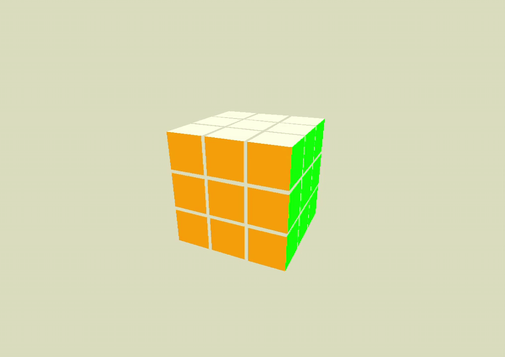

# Cube_sims
My 3d game engine

Required installations:  
`$ pip install pygame`
`$ pip install RubikTwoPhase`

## cube.py
An interactive simulation that shows the extent of this engine.  

### controls:

#### moving:
`w`,`a`,`s`,`d`  : look around  
`>` (.) : move forwards  
`<` (,) : move backwards  
`[arrow keys]` : move camera  

#### presets:
`1` : 40 cubes arranged randomly  
`2` : solar system gravity simulation  
`3` : 216 cubes  

#### more:
`g` : toggle **gravity** on/off  
`[right shift]` : **Shoot** bullets to destroy cubes. if gravity is on, cubes explode  
`[cursor on circle]` : **Rotate** all cubes  
`[space ]` : toggles look around with cursor

## Rubix Twobe.py
An interactive 3d Rubix cube.  

### controls:

#### Rotate faces:
`u`,`d`,`l`,`r`,`f`,`b` : rotate faces of the cube  
`h` : toggle shuffling  
`s`: solve  

#### Move around:
`[arrow keys]` : rotate entire cube  
`>` (.) : move forwards  
`<` (,) : move backwards  

#### other:
`m` toggles info display

